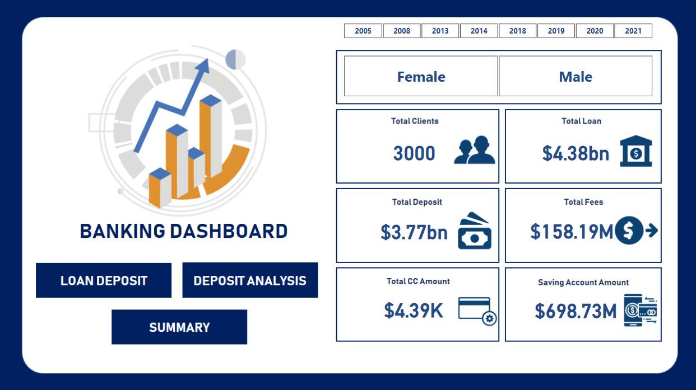
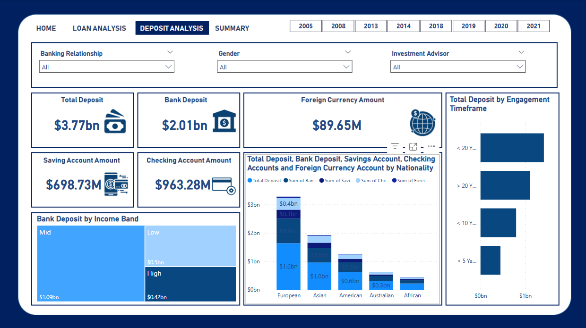
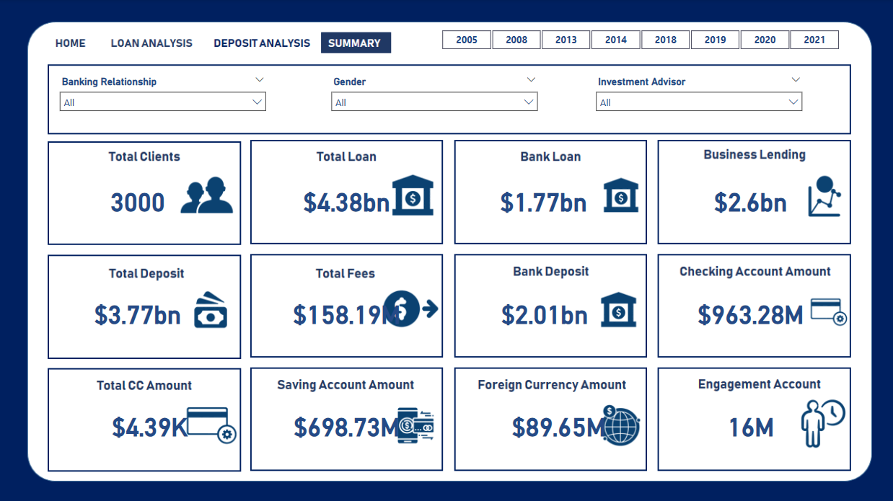

# 📊 Banking Analysis with Power BI

Welcome to the **Banking Analysis** project! This repository showcases an interactive **Power BI** dashboard built to analyze and visualize key banking data. The goal of this project is to provide meaningful insights into banking operations, customer behavior, and performance metrics.

---

## 🔍 Project Overview

The banking sector generates massive amounts of data daily. This project aims to:

✅ Analyze customer data and bank transactions  
✅ Identify trends and patterns in key financial metrics  
✅ Visualize findings using **Power BI** to enable data-driven decisions  

The interactive **Power BI dashboard** provides a clear, concise view of the following aspects:
- Customer demographics
- Account balances and transaction history
- Loan distributions
- Bank performance metrics (e.g., total deposits, withdrawals)

---

## 🛠️ Tools & Technologies

- **Power BI**: For creating the interactive dashboards  
- **SQL**: For data extraction and cleaning from databases  
- **Python (pandas, matplotlib, seaborn)**: For exploratory data analysis (EDA)  
- **Excel/CSV**: Raw data files used for analysis  

---

## 📂 Project Structure

├── Data/ # Contains raw data files (e.g., CSV or Excel)
├── Reports/ # Power BI report files (.pbix)
├── Screenshots/ # Images of the Power BI dashboard
├── SQL/ # SQL queries used for data extraction/cleaning
├── EDA/ # Python notebooks or scripts for data exploration
└── README.md # Project overview and documentation

📸 Sample Screenshots
Here are sample screenshots of the Power BI dashboard.

📊 Home

💰 Loan Analysis

🔄 Deposit Analysis

🏦 Summary

🧹 Data Preparation and Exploration
SQL Queries: Extracted and cleaned raw banking data. Find scripts in the SQL/ folder.

data_extraction.sql: SQL query to pull data from source databases.

data_cleaning.sql: SQL query to clean and prepare data for analysis.

Python EDA: Explored data using Python (pandas, matplotlib, seaborn) to:

Check for missing values

Visualize distributions and relationships

Identify trends and anomalies

Prepare data for Power BI

Explore the Python notebook EDA/eda.ipynb and script EDA/data_visualizations.py for the EDA process.

📈 Key Insights
Customer base shows diverse demographics and varying account balances.

Transaction trends highlight peak periods and common transaction types.

Loan distribution indicates customer preferences and potential risks.

Branch performance analysis reveals top-performing locations.

🤝 Contributing
Contributions are welcome! Feel free to:

Suggest improvements to the analysis

Add new visualizations or data sources

Share feedback

## 📬 Contact
For any questions or feedback, feel free to connect:

**Muhammed Shabnas P A**  
📧 Email: muhammedshabnaspa@gmail.com  
🔗 GitHub: [@Muhammed-Shabnas-PA](https://github.com/Muhammed-Shabnas-PA)

---

🌟 Thank you for exploring this project! Feel free to star ⭐ the repository if you find it helpful!
